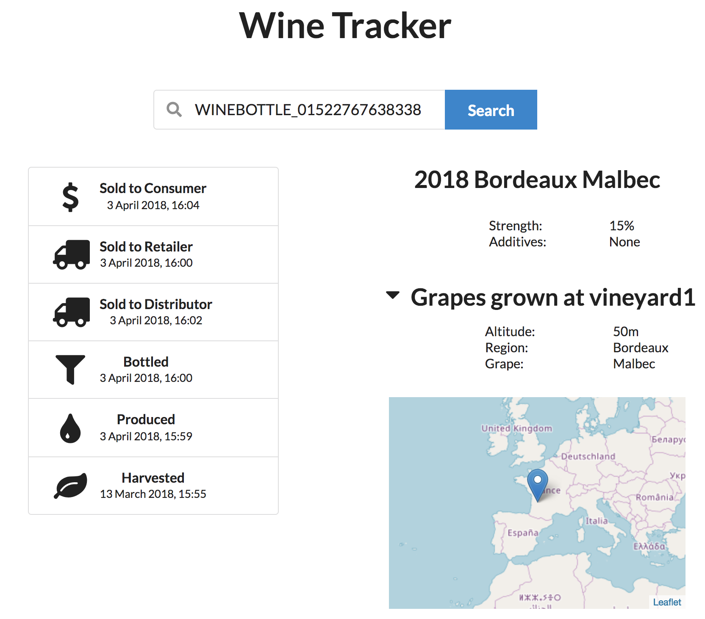

# Prequisites

* Docker
* Postman
* Node.js / npm
* yarn

# Install

## Download Fabric Docker images

```
curl -sSL https://goo.gl/6wtTN5 | bash -s 1.1.0-rc1
```

([docs](https://hyperledger-fabric.readthedocs.io/en/release-1.1/samples.html#binaries))

## Install Composer command line tools

```
npm i -g composer-cli@0.16.3 composer-rest-server@0.16.3 passport-github
```

## Import sample participant identities

```
cd network
./importIdCards.sh
```

## Enable authentication for API server

[Create a new OAuth application on GitHub](https://github.com/settings/applications/new)

* Application name: `composer-rest-server`
* Homepage URL: `http://localhost:3000/`
* Application description: `OAuth application for the multi-user mode of composer-rest-server`
* Authorization callback URL: `http://localhost:3000/auth/github/callback`

# Run

## Start the network

```
# in 'network' directory
export COMPOSE_PROJECT_NAME=biswas
./deployNetwork.sh
```

## Start the API server

```
export COMPOSER_PROVIDERS='{
  "github": {
    "provider": "github",
    "module": "passport-github",
    "clientID": "REPLACE_WITH_CLIENT_ID",
    "clientSecret": "REPLACE_WITH_CLIENT_SECRET",
    "authPath": "/auth/github",
    "callbackURL": "/auth/github/callback",
    "successRedirect": "/",
    "failureRedirect": "/"
  }
}'

composer-rest-server -c grower-network-admin@biswas -a true -m true
```

The API explorer is now located http://localhost:3000/explorer.

# Interacting with the network

## Import identities into API server

* Navigate to http://localhost:3000/auth/github and authenticate with GitHub
* Find the `/wallet/import` endpoint at the bottom of the list in the API explorer
* Import the admin identity card from `./network/fabric/id-cards/grower-network-admin/card` using the name `admin`
* Import the identity cards for the sample network participants from `./network/fabric/id-cards/users` using the same endpoint. The names should be the same as the name of the card, i.e. the file `distributor.card` should be imported as `distributor`

## Add sample data using Postman

* Navigate to the [end-to-end test run documentation](https://documenter.getpostman.com/view/2277062/integration-tests/RVu2nAni) and click 'Run in Postman'
* Select the imported `sample-env` environment
* Display your OAuth access token in the explorer by clicking 'show'. Copy this into your Postman environment as the value for the key `accessToken`
* Run the requests using the collection runner

## View traceability information

* Copy your OAuth access token into line 9 of `./frontend/src/controllers/api.js`
* Start the web application by running `yarn start` inside `./frontend`
* Copy the value of `bottleID` from the Postman environment
* Navigate to the frontend at http://localhost:3001/
* Search for the copied bottleID.



# Development

## Unit tests

```
# in ./network/composer
npm t
```
